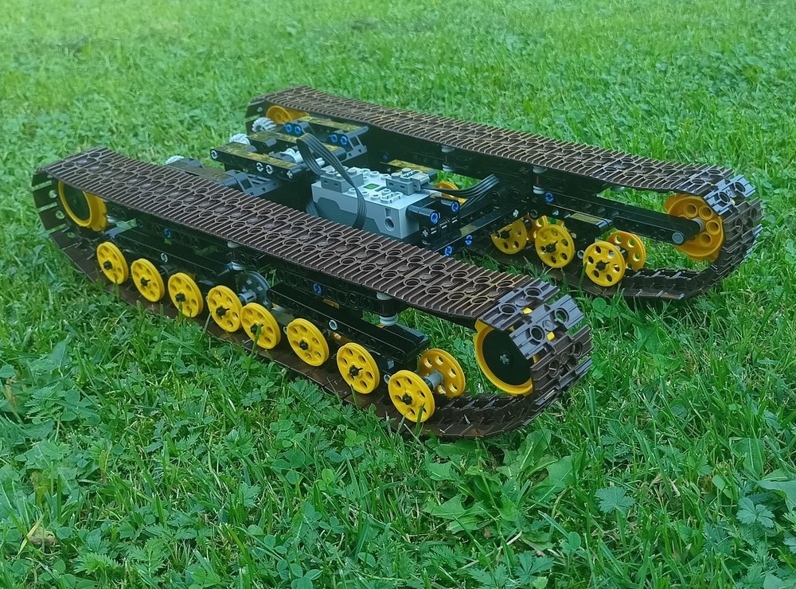

# Hardware

## **Controller**

### Design

### Hardware List
1x [PSOC : Don't know yet]()  

## **Tank**

### Design
[MOC - Tank Chassis](https://rebrickable.com/mocs/MOC-158980/Tykenen/tank-chassis/#parts)   

### Hardware List
- 1x [PSOC : Don't know yet]()  
- 2x [BTS7960 Motor Driver](https://www.bitsandparts.nl/Motor-driver-module-BTS7960-H-Bridge-High-Power-43A-p1907082) 
- 2x [Electric Motor](https://www.bricklink.com/v2/catalog/catalogitem.page?P=5292c01#T=C)  
- 1x [Step down buck Converter](https://www.benselectronics.nl/step-down-dc-dc-buck-converter-12a-200w-max.html)    
- 1x [Step-down buck Converter USB](https://www.benselectronics.nl/dc-dc-step-down-buck-converter-met-voltmeter.html)
- 1x [3S LIPO 5200maH](https://www.toemen.nl/product/toemen-modelsport-power-racing-60c-5200mah-3s-111v-lipo-batterij-met-xt90-stekker)
- 1x [Lipo Charger](https://www.toemen.nl/product/rc-plus-power-80-lipo-en-nimh-snellader)  
